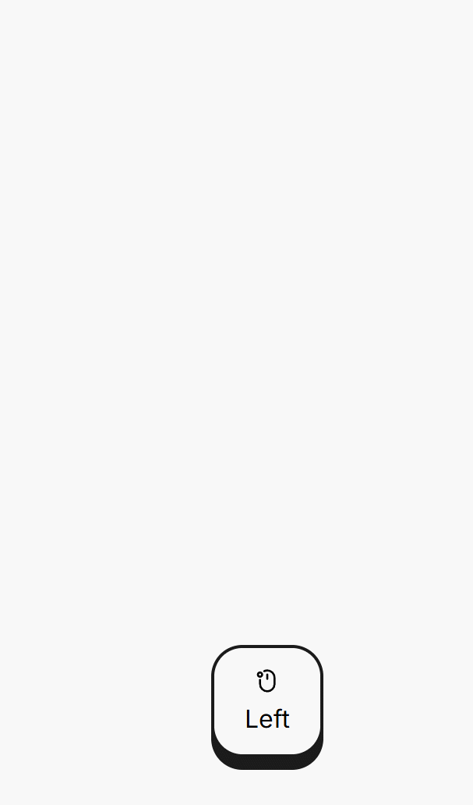

# 推導的晚清寧波話吳語拼音輸入方案

配方：℞ **shinzoqchiuq/rime-wugniu_gninpou_old**

本輸入方案是爲了方便錄入和轉寫 [罗马字宁波话文献整理转写](https://github.com/shinzoqchiuq/books-in-wu-romanization) 項目而製作。

## 製作緣起

十九世紀五十年代至二十世紀三十年代，派駐寧波的基督教傳教士使用一套統一的羅馬字方案，出版了衆多寧波方言（寧波土話/寧波土白）書籍。這些出版物多數只有書影，未被整理爲文本格式。爲了整理文本並將羅馬字文本轉寫爲漢字，需要趁手的工具。輸入法能夠鍵入字母，列出符合讀音的候選詞，是轉寫羅馬字的好工具。

然而，現有的另一 [晚清寧波話輸入方案](https://github.com/ionkaon/rime-old-nyingpo) 在用作轉寫工具時，存在如下缺點：

1. 僅收錄 *The Ningpo Syllabary* 一書記錄的字音，收字少，且缺少方言詞。
2. 拼音方案爲傳教士羅馬字，非 ASCII 字符用雙寫等方式表示，與現在常用的吳語拼音方案不兼容。

[現代寧波話輸入方案](https://github.com/NGLI/rime-wugniu_gninpou) 雖然收錄的字、詞更全，且使用吳拼，但現代寧波話與晚清寧波話在音系上有諸多不同，多有簡化。應用於轉寫時，存在如下兩個困難：

1. 需要首先在腦中將看到的羅馬字推導到現代寧波話讀音。

2. 現代寧波話語音較晚清多有簡化，候選詞中常有讀音不合的詞語。

例如看到羅馬字 *kyi-sing*（後文傳教士羅馬字均用斜體，吳拼用正體），需要首先推導至現代寧波話讀音 ci shin。但現代寧波話的 ci shin 可能對應晚清寧波話 {*tsi-sing*, *kyi-sing*, *tsin-sing*, *kyin-sing*, *tsi-hying*, *kyi-hying*, *tsin-hying*, *kyin-hying*} 這 8 種不同的讀音。因此鍵入 ci shin，候選詞中可能出現「堅信 *kyin-sing*」「戰勝 *tsin-sing*」等讀音與 *kyi-sing* 不合的詞，干擾判斷。

因此需要一種輸入方案，既能保留 [現代寧波話輸入方案](https://github.com/NGLI/rime-wugniu_gninpou) 收字、收詞全的優點，又能按照晚清寧波話的音系輸入。所幸，在製作 [現代寧波話輸入方案](https://github.com/NGLI/rime-wugniu_gninpou) 所用到的 [字表](https://github.com/ionkaon/dictionary#字表) 項目中，已經對此做了預留。該字表的排序，依照現代寧波話的讀音，將同音字排在一起，而同音字組內部，又按照晚清寧波話的理論讀音做了排序。例如音節 ci1 的內部，按照 *tsi*、*kyi*、*tsin*、*kyin* 的順序排序，並且在每一組的末尾留有一行註釋。如此一來，就能通過 [字表](https://github.com/ionkaon/dictionary#字表) 項目分開現代寧波話的同音字，生成符合晚清寧波話音系的字表了。對於詞彙，[現代寧波話輸入方案](https://github.com/NGLI/rime-wugniu_gninpou) 所收部分詞彙標註了現代寧波話讀音，利用每個漢字現代音與晚清音的對照關係，也能輕鬆將詞表推導至清末音系。這樣就生成了本倉庫的輸入方案碼表。

## 音系與拼音方案

爲了（本人）打字順手，且爲了方便在晚清寧波話與現代寧波話輸入方案之間切換。本倉庫的輸入方案並未直接使用傳教士羅馬字作爲拼音方案，而是將其轉寫爲一套吳語拼音方案。音系及具體轉寫如下（斜體爲傳教士羅馬字，正體爲吳拼）：

### 聲母

<table>
 <tbody>
  <tr>
   <td align="center"><i>p</i></td>
   <td align="center">p</td>
   <td align="center"><i>pʽ</i></td>
   <td align="center">ph</td>
   <td align="center"><i>b</i></td>
   <td align="center">b</td>
   <td align="center"><i>m</i></td>
   <td align="center">m</td>
   <td align="center"><i>m̆</i></td>
   <td align="center">mh</td>
   <td align="center"><i>f</i></td>
   <td align="center">f</td>
   <td align="center"><i>v</i></td>
   <td align="center">v</td>
  </tr>
  <tr>
   <td align="center" colspan=2>邊包班百</td>
   <td align="center" colspan=2>偏怕飄拍</td>
   <td align="center" colspan=2>皮抱辦白</td>
   <td align="center" colspan=2>棉毛梅麥</td>
   <td align="center" colspan=2>咪嘸</td>
   <td align="center" colspan=2>飛反方法</td>
   <td align="center" colspan=2>維飯房罰</td>
  </tr>
  <tr>
   <td align="center"><i>t</i></td>
   <td align="center">t</td>
   <td align="center"><i>tʽ</i></td>
   <td align="center">th</td>
   <td align="center"><i>d</i></td>
   <td align="center">d</td>
   <td align="center"><i>n</i></td>
   <td align="center">n</td>
   <td align="center"><i>n̆</i></td>
   <td align="center">nh</td>
   <td align="center"> </td>
   <td align="center"> </td>
   <td align="center"> </td>
   <td align="center"> </td>
  </tr>
  <tr>
   <td align="center" colspan=2>底帶燈搭</td>
   <td align="center" colspan=2>天跳通塔</td>
   <td align="center" colspan=2>田逃亭踏</td>
   <td align="center" colspan=2>努腦嫩捺</td>
   <td align="center" colspan=2>㖠</td>
   <td align="center" colspan=2> </td>
   <td align="center" colspan=2> </td>
  </tr>
  <tr>
   <td align="center"> </td>
   <td align="center"> </td>
   <td align="center"> </td>
   <td align="center"> </td>
   <td align="center"> </td>
   <td align="center"> </td>
   <td align="center"><i>l</i></td>
   <td align="center">l</td>
   <td align="center"><i>l̆</i></td>
   <td align="center">lh</td>
   <td align="center"> </td>
   <td align="center"> </td>
   <td align="center"> </td>
   <td align="center"> </td>
  </tr>
  <tr>
   <td align="center" colspan=2> </td>
   <td align="center" colspan=2> </td>
   <td align="center" colspan=2> </td>
   <td align="center" colspan=2>裏來亮辣</td>
   <td align="center" colspan=2>嘮</td>
   <td align="center" colspan=2> </td>
   <td align="center" colspan=2> </td>
  </tr>
  <tr>
   <td align="center"><i>ts</i></td>
   <td align="center">ts</td>
   <td align="center"><i>tsʽ</i></td>
   <td align="center">tsh</td>
   <td align="center"><i>dz</i></td>
   <td align="center">dz</td>
   <td align="center"> </td>
   <td align="center"> </td>
   <td align="center"> </td>
   <td align="center"> </td>
   <td align="center"><i>s</i></td>
   <td align="center">s</td>
   <td align="center"><i>z</i></td>
   <td align="center">z</td>
  </tr>
  <tr>
   <td align="center" colspan=2>子尖走足</td>
   <td align="center" colspan=2>刺千蔥促</td>
   <td align="center" colspan=2>慈池存族</td>
   <td align="center" colspan=2> </td>
   <td align="center" colspan=2> </td>
   <td align="center" colspan=2>四西孫速</td>
   <td align="center" colspan=2>字徐上石</td>
  </tr>
  <tr>
   <td align="center"><i>c</i></td>
   <td align="center">c</td>
   <td align="center"><i>cʽ</i></td>
   <td align="center">ch</td>
   <td align="center"><i>dj</i></td>
   <td align="center">j</td>
   <td align="center"> </td>
   <td align="center"> </td>
   <td align="center"> </td>
   <td align="center"> </td>
   <td align="center"><i>sh</i></td>
   <td align="center">sh</td>
   <td align="center"><i>j</i></td>
   <td align="center">zh</td>
  </tr>
  <tr>
   <td align="center" colspan=2>朱專俊竹</td>
   <td align="center" colspan=2>取川窗出</td>
   <td align="center" colspan=2>住全重絕</td>
   <td align="center" colspan=2> </td>
   <td align="center" colspan=2> </td>
   <td align="center" colspan=2>書選雙雪</td>
   <td align="center" colspan=2>如船尙熟</td>
  </tr>
   <td align="center"><i>ky</i></td>
   <td align="center">c</td>
   <td align="center"><i>kyʽ</i></td>
   <td align="center">ch</td>
   <td align="center"><i>gy</i></td>
   <td align="center">j</td>
   <td align="center"><i>ny</i></td>
   <td align="center">gn</td>
   <td align="center"><i>n̆y</i></td>
   <td align="center">kn</td>
   <td align="center"><i>hy</i></td>
   <td align="center">sh</td>
   <td align="center"><i>y</i></td>
   <td align="center">y</td>
  </tr>
  <tr>
   <td align="center" colspan=2>記郊君結</td>
   <td align="center" colspan=2>氣巧輕挈</td>
   <td align="center" colspan=2>棋橋裙極</td>
   <td align="center" colspan=2>泥饒寧業</td>
   <td align="center" colspan=2>☐</td>
   <td align="center" colspan=2>希曉興吸</td>
   <td align="center" colspan=2>以搖幸頁</td>
  </tr>
  <tr>
   <td align="center"><i>k</i></td>
   <td align="center">k</td>
   <td align="center"><i>kʽ</i></td>
   <td align="center">kh</td>
   <td align="center"><i>g</i></td>
   <td align="center">g</td>
   <td align="center"><i>ng</i></td>
   <td align="center">ng</td>
   <td align="center"><i>n̆g</i></td>
   <td align="center">nk</td>
   <td align="center"> </td>
   <td align="center"> </td>
   <td align="center"> </td>
   <td align="center"> </td>
  </tr>
  <tr>
   <td align="center" colspan=2>歌高改格</td>
   <td align="center" colspan=2>科考開客</td>
   <td align="center" colspan=2>共軋</td>
   <td align="center" colspan=2>熬鵝額</td>
   <td align="center" colspan=2>☐</td>
   <td align="center" colspan=2> </td>
   <td align="center" colspan=2> </td>
  </tr>
  <tr>
   <td align="center"><i>kw</i></td>
   <td align="center">ku</td>
   <td align="center"><i>kwʽ</i></td>
   <td align="center">khu</td>
   <td align="center"><i>gw</i></td>
   <td align="center">gu</td>
   <td align="center"><i>ngw</i></td>
   <td align="center">ngu</td>
   <td align="center"> </td>
   <td align="center"> </td>
   <td align="center"> </td>
   <td align="center"> </td>
   <td align="center"> </td>
   <td align="center"> </td>
  </tr>
  <tr>
   <td align="center" colspan=2>古拐關光</td>
   <td align="center" colspan=2>苦快塊框</td>
   <td align="center" colspan=2>跍葵摜狂</td>
   <td align="center" colspan=2>吾危幻兀</td>
   <td align="center" colspan=2> </td>
   <td align="center" colspan=2> </td>
   <td align="center" colspan=2> </td>
  </tr>
  <tr>
   <td align="center"><i>∅</i></td>
   <td align="center">∅</td>
   <td align="center"> </td>
   <td align="center"> </td>
   <td align="center"> </td>
   <td align="center"> </td>
   <td align="center"> </td>
   <td align="center"> </td>
   <td align="center"> </td>
   <td align="center"> </td>
   <td align="center"><i>h</i></td>
   <td align="center">h</td>
   <td align="center"><i>ʽ</i></td>
   <td align="center">gh</td>
  </tr>
  <tr>
   <td align="center" colspan=2> </td>
   <td align="center" colspan=2> </td>
   <td align="center" colspan=2> </td>
   <td align="center" colspan=2> </td>
   <td align="center" colspan=2> </td>
   <td align="center" colspan=2>海火漢黑</td>
   <td align="center" colspan=2>害河寒合</td>
  </tr>
  <tr>
   <td align="center"><i>w̆</i></td>
   <td align="center">u</td>
   <td align="center"> </td>
   <td align="center"> </td>
   <td align="center"> </td>
   <td align="center"> </td>
   <td align="center"> </td>
   <td align="center"> </td>
   <td align="center"> </td>
   <td align="center"> </td>
   <td align="center"><i>hw</i></td>
   <td align="center">hu</td>
   <td align="center"><i>w</i></td>
   <td align="center">w</td>
  </tr>
  <tr>
   <td align="center" colspan=2>威溫蛙汪</td>
   <td align="center" colspan=2> </td>
   <td align="center" colspan=2> </td>
   <td align="center" colspan=2> </td>
   <td align="center" colspan=2> </td>
   <td align="center" colspan=2>呼灰昏忽</td>
   <td align="center" colspan=2>湖會魂活</td>
  </tr>
 </tbody>
</table>

表中「☐」表示有音無字。

### 韻母

<table>
 <tbody>
  <tr>
   <td align="center"><i>∅</i></td>
   <td align="center">y</td>
   <td align="center"><i>i</i></td>
   <td align="center">i</td>
   <td align="center"><i>u</i></td>
   <td align="center">u</td>
   <td align="center"><i>ü</i></td>
   <td align="center">iu</td>
  </tr>
  <tr>
   <td align="center" colspan=2>子次絲是</td>
   <td align="center" colspan=2>比飛低移</td>
   <td align="center" colspan=2>補租孤胡</td>
   <td align="center" colspan=2>朱區虛雨</td>
  </tr>
  <tr>
   <td align="center"><i>a</i></td>
   <td align="center">a</td>
   <td align="center"><i>ia</i></td>
   <td align="center">ia</td>
   <td align="center"> </td>
   <td align="center"> </td>
   <td align="center"> </td>
   <td align="center"> </td>
  </tr>
  <tr>
   <td align="center" colspan=2>擺太快鞋</td>
   <td align="center" colspan=2>爹姐謝爺</td>
   <td align="center" colspan=2> </td>
   <td align="center" colspan=2> </td>
  </tr>
  <tr>
   <td align="center"><i>ô</i></td>
   <td align="center">o</td>
   <td align="center"> </td>
   <td align="center"> </td>
   <td align="center"> </td>
   <td align="center"> </td>
   <td align="center"><i>üô</i></td>
   <td align="center">io</td>
  </tr>
  <tr>
   <td align="center" colspan=2>怕畫遮蛙</td>
   <td align="center" colspan=2> </td>
   <td align="center" colspan=2> </td>
   <td align="center" colspan=2>嘉霞</td>
  </tr>
  <tr>
   <td align="center"><i>æ</i></td>
   <td align="center">e</td>
   <td align="center"><i>iæ</i></td>
   <td align="center">ie</td>
   <td align="center"> </td>
   <td align="center"> </td>
   <td align="center"> </td>
   <td align="center"> </td>
  </tr>
  <tr>
   <td align="center" colspan=2>歹再懷害</td>
   <td align="center" colspan=2>皆械</td>
   <td align="center" colspan=2> </td>
   <td align="center" colspan=2> </td>
  </tr>
  <tr>
   <td align="center"><i>e</i></td>
   <td align="center">ei</td>
   <td align="center"> </td>
   <td align="center"> </td>
   <td align="center"> </td>
   <td align="center"> </td>
   <td align="center"> </td>
   <td align="center"> </td>
  </tr>
  <tr>
   <td align="center" colspan=2>杯堆灰追</td>
   <td align="center" colspan=2> </td>
   <td align="center" colspan=2> </td>
   <td align="center" colspan=2> </td>
  </tr>
  <tr>
   <td align="center"><i>o</i></td>
   <td align="center">ou</td>
   <td align="center"> </td>
   <td align="center"> </td>
   <td align="center"> </td>
   <td align="center"> </td>
   <td align="center"> </td>
   <td align="center"> </td>
  </tr>
  <tr>
   <td align="center" colspan=2>破多過河</td>
   <td align="center" colspan=2> </td>
   <td align="center" colspan=2> </td>
   <td align="center" colspan=2> </td>
  </tr>
  <tr>
   <td align="center"><i>ao</i></td>
   <td align="center">au</td>
   <td align="center"><i>iao</i></td>
   <td align="center">iau</td>
   <td align="center"> </td>
   <td align="center"> </td>
   <td align="center"> </td>
   <td align="center"> </td>
  </tr>
  <tr>
   <td align="center" colspan=2>包刀早高</td>
   <td align="center" colspan=2>標照小要</td>
   <td align="center" colspan=2> </td>
   <td align="center" colspan=2> </td>
  </tr>
  <tr>
   <td align="center"><i>eo</i></td>
   <td align="center">eu</td>
   <td align="center"><i>iu</i></td>
   <td align="center">ieu</td>
   <td align="center"> </td>
   <td align="center"> </td>
   <td align="center"> </td>
   <td align="center"> </td>
  </tr>
  <tr>
   <td align="center" colspan=2>走兜夠厚</td>
   <td align="center" colspan=2>留周繡油</td>
   <td align="center" colspan=2> </td>
   <td align="center" colspan=2> </td>
  </tr>
  <tr>
   <td align="center"><i>æn</i></td>
   <td align="center">aen</td>
   <td align="center"> </td>
   <td align="center"> </td>
   <td align="center"> </td>
   <td align="center"> </td>
   <td align="center"> </td>
   <td align="center"> </td>
  </tr>
  <tr>
   <td align="center" colspan=2>班關盞灣</td>
   <td align="center" colspan=2> </td>
   <td align="center" colspan=2> </td>
   <td align="center" colspan=2> </td>
  </tr>
  <tr>
   <td align="center"><i>en</i></td>
   <td align="center">ein1</td>
   <td align="center"><i>in</i></td>
   <td align="center">ien</td>
   <td align="center"><i>un</i></td>
   <td align="center">un</td>
   <td align="center"><i>ün</i></td>
   <td align="center">ioen</td>
  </tr>
  <tr>
   <td align="center" colspan=2>探甘岸安</td>
   <td align="center" colspan=2>邊點尖見</td>
   <td align="center" colspan=2>半官換碗</td>
   <td align="center" colspan=2>專選捐鴛</td>
  </tr>
  <tr>
   <td align="center"><i>ön</i></td>
   <td align="center">oen</td>
   <td align="center"> </td>
   <td align="center"> </td>
   <td align="center"> </td>
   <td align="center"> </td>
   <td align="center"> </td>
   <td align="center"> </td>
  </tr>
  <tr>
   <td align="center" colspan=2>短暖鑽酸</td>
   <td align="center" colspan=2> </td>
   <td align="center" colspan=2> </td>
   <td align="center" colspan=2> </td>
  </tr>
  <tr>
   <td align="center"><i>ang</i></td>
   <td align="center">an</td>
   <td align="center"><i>iang</i></td>
   <td align="center">ian</td>
   <td align="center"> </td>
   <td align="center"> </td>
   <td align="center"> </td>
   <td align="center"> </td>
  </tr>
  <tr>
   <td align="center" colspan=2>繃打坑硬</td>
   <td align="center" colspan=2>兩張響樣</td>
   <td align="center" colspan=2> </td>
   <td align="center" colspan=2> </td>
  </tr>
  <tr>
   <td align="center"><i>ông</i></td>
   <td align="center">aon</td>
   <td align="center"> </td>
   <td align="center"> </td>
   <td align="center"> </td>
   <td align="center"> </td>
   <td align="center"><i>üông</i></td>
   <td align="center">iaon</td>
  </tr>
  <tr>
   <td align="center" colspan=2>幫當光剛</td>
   <td align="center" colspan=2> </td>
   <td align="center" colspan=2> </td>
   <td align="center" colspan=2>降</td>
  </tr>
  <tr>
   <td align="center"><i>eng</i></td>
   <td align="center">en</td>
   <td align="center"><i>ing</i></td>
   <td align="center">in</td>
   <td align="center"> </td>
   <td align="center"> </td>
   <td align="center"><i>üing</i></td>
   <td align="center">iun</td>
  </tr>
  <tr>
   <td align="center" colspan=2>本登魂根</td>
   <td align="center" colspan=2>餅精春印</td>
   <td align="center" colspan=2> </td>
   <td align="center" colspan=2>均裙訓勻</td>
  </tr>
  <tr>
   <td align="center"><i>ong</i></td>
   <td align="center">on</td>
   <td align="center"> </td>
   <td align="center"> </td>
   <td align="center"> </td>
   <td align="center"> </td>
   <td align="center"><i>üong</i></td>
   <td align="center">ion</td>
  </tr>
  <tr>
   <td align="center" colspan=2>風東宗公</td>
   <td align="center" colspan=2> </td>
   <td align="center" colspan=2> </td>
   <td align="center" colspan=2>濃窮兄用</td>
  </tr>
  <tr>
   <td align="center"><i>ah</i></td>
   <td align="center">aq</td>
   <td align="center"><i>iah</i></td>
   <td align="center">iaq</td>
   <td align="center"> </td>
   <td align="center"> </td>
   <td align="center"> </td>
   <td align="center"> </td>
  </tr>
  <tr>
   <td align="center" colspan=2>百法滑格</td>
   <td align="center" colspan=2>貼甲藥約</td>
   <td align="center" colspan=2> </td>
   <td align="center" colspan=2> </td>
  </tr>
  <tr>
   <td align="center"><i>eh</i></td>
   <td align="center">eq</td>
   <td align="center"><i>ih</i></td>
   <td align="center">iq</td>
   <td align="center"> </td>
   <td align="center"> </td>
   <td align="center"><i>üih</i></td>
   <td align="center">iuq</td>
  </tr>
  <tr>
   <td align="center" colspan=2>撥弗活割</td>
   <td align="center" colspan=2>筆立出乙</td>
   <td align="center" colspan=2> </td>
   <td align="center" colspan=2>決缺掘月</td>
  </tr>
  <tr>
   <td align="center"><i>ôh</i></td>
   <td align="center">aoq</td>
   <td align="center"> </td>
   <td align="center"> </td>
   <td align="center"> </td>
   <td align="center"> </td>
   <td align="center"><i>üôh</i></td>
   <td align="center">iaoq</td>
  </tr>
  <tr>
   <td align="center" colspan=2>毒落各或</td>
   <td align="center" colspan=2> </td>
   <td align="center" colspan=2> </td>
   <td align="center" colspan=2>確鬱育</td>
  </tr>
  <tr>
   <td align="center"><i>oh</i></td>
   <td align="center">oq</td>
   <td align="center"> </td>
   <td align="center"> </td>
   <td align="center"> </td>
   <td align="center"> </td>
   <td align="center"><i>üoh</i></td>
   <td align="center">ioq</td>
  </tr>
  <tr>
   <td align="center" colspan=2>北讀六穀</td>
   <td align="center" colspan=2> </td>
   <td align="center" colspan=2> </td>
   <td align="center" colspan=2>鞠曲玉疫</td>
  </tr>
  <tr>
   <td align="center"><i>r</i></td>
   <td align="center">er</td>
   <td align="center"> </td>
   <td align="center"> </td>
   <td align="center"> </td>
   <td align="center"> </td>
   <td align="center"> </td>
   <td align="center"> </td>
  </tr>
  <tr>
   <td align="center" colspan=2>而</td>
   <td align="center" colspan=2> </td>
   <td align="center" colspan=2> </td>
   <td align="center" colspan=2> </td>
  </tr>
  <tr>
   <td align="center"><i>m</i></td>
   <td align="center">m</td>
   <td align="center"> </td>
   <td align="center"> </td>
   <td align="center"> </td>
   <td align="center"> </td>
   <td align="center"> </td>
   <td align="center"> </td>
  </tr>
  <tr>
   <td align="center" colspan=2>姆嘸</td>
   <td align="center" colspan=2> </td>
   <td align="center" colspan=2> </td>
   <td align="center" colspan=2> </td>
  </tr>
  <tr>
   <td align="center"><i>ng</i></td>
   <td align="center">ng</td>
   <td align="center"> </td>
   <td align="center"> </td>
   <td align="center"> </td>
   <td align="center"> </td>
   <td align="center"> </td>
   <td align="center"> </td>
  </tr>
  <tr>
   <td align="center" colspan=2>俉</td>
   <td align="center" colspan=2> </td>
   <td align="center" colspan=2> </td>
   <td align="center" colspan=2> </td>
  </tr>
 </tbody>
</table>

### 聲調

本倉庫輸入方案不區分聲調。

註：

1. 韻母 ein 在聲母 ng、h 後也可拼作 een；在 k、kh 後拼作 ien，也略拼作 i。
2. 韻母 aen、oen、ioen 也略拼作 ae、oe、ioe。
3. c 組聲母接韻母 iu、ioen、in、iq 時，韻母分別拼作 yu、oen、yun、yuq。如「書」「全」「順」「出」分別拼作 shyu、joen、zhyun、chyuq。
4. 傳教士羅馬字中將 *kw*、*kwʽ*、*gw*、*ngw*、*w̆*、*hw*、*w* 分析爲聲母，取消了除 *u*、*un* 外所有合口呼韻母。也可以將這些音節分析爲 *k*、*kʽ*、*g*、*ng*、*∅*、*h*、*ʽ* 聲母加上合口呼韻母。這樣分析，音系裏會增加 *wa*、*wô*、*wæ*、*we*、*wæn*、*wang*、*wông*、*weng*、*wah*、*weh* 這 10 個合口呼韻母。
5. 聲母 y、w 單獨列出，後接韻母是按照吳拼規則，接 i 開頭的韻母時，省略 i，如「野」ya，「搖」yau，但若 i 後沒有其他元音字母，需保留 i，如「移」yi，「形」yin，「葉」yiq。後接 iu 開頭的韻母時，簡寫爲 yu，如「雨」yu，「雲」yun。後接 u 開頭的韻母時，省略 u，如「回」wei，「黃」waon，但若 u 後沒有其他元音字母，需保留 u，如「胡」wu，「換」wun。
6. 零聲母在列舉聲母時作 ∅，搭配韻母時不寫，如「壓」aq。
7. er、m、n、ng 爲四個自成音節的韻母，拼寫時只需寫自身，如「而」er，「五」ng。

## 注意事項

由於是從現代寧波話讀音反推而來，未做專門修訂，並非嚴謹的傳教士時期記錄，本輸入方案已知存在如下問題：

1. **文獻外字音**：本輸入方案收字較多，存在許多漢字傳教士未記錄其讀音。本輸入方案雖然收錄這些字音，僅代表這些字在晚清寧波話中可能的讀音，並非真實存在的記錄字音，使用時需要注意。
2. **例外字**：本輸入方案假定字音規則演變。但傳教士所記部分漢字讀音與今音之間存在不規則演變。如「就 *ziu*」「贖 *joh*」按照演變規律，今音當爲 zhieu、zoq。然而該二字今音分別爲 jieu、dzoq。在本輸入方案雖然爲此二字增加了 *ziu* 和 *joh* 的讀音，但也保留了錯誤反推音 *dziu*、*djoh* 未刪除。除此以外，還有許多例外字存在反推錯誤，使用時需要注意。
3. **模糊音**：寧波話傳教士文獻年代跨度大，部分聲、韻母在後期記錄中有相混的現象，按時間早晚分別有 *ôh*、*oh* 相混，*c* 組、*ts* 組相混，*eh*、*ah* 相混。其中 *ôh*、*oh* 相混年代較早，本輸入方案中完全不區分這兩個韻母，視作自由變體。其餘兩組均默認開啓模糊音。
4. **讀音合併**：「仇」字作姓氏時音 *gyiu*；表仇恨義時本字爲「讎」，音 *dziu*。*gyiu* 與 *dziu* 在現代寧波話中合併爲 jieu。在本輸入方案雖然爲該字收錄了兩個讀音，但反推過程中無法動態判斷每個詞中「仇」字用的是哪個意思，目前統一爲 *dziu* 音，可能存在部分詞語反推錯誤。另有極少數其他字也存在讀音合併現象，需要注意。
5. 極少數字，如「個 *go*」「呢 *ni*」，輸入方案中未收錄其晚清讀音，僅收錄現代音 goq、gni。

## 安裝

安裝請參考 [寧波話吳語拼音輸入方案](https://github.com/NGLI/rime-wugniu_gninpou)。

## 使用

本倉庫提供兩款輸入方案，均使用吳語拼音輸入，一種顯示吳語拼音，另一種顯示爲傳教士羅馬字。顯示傳教士羅馬字時，可按 `Shift` + `Enter` 將羅馬字上屏。

## 其他

- [寧波話吳語拼音輸入方案](https://github.com/NGLI/rime-wugniu_gninpou)
- [寧波話輸入方案變體](https://github.com/ionkaon/rime-gninpou-variant)
- [寧波話雙拼輸入方案](https://github.com/ionkaon/rime-gninpou-saonphin)
- [寧波話兩分輸入方案](https://github.com/ionkaon/rime-gninpou-lianfen)
- [晚清寧波話輸入方案](https://github.com/ionkaon/rime-old-nyingpo)

## 聯繫

[Shin Zoqchiuq](https://github.com/shinzoqchiuq)：

- 郵箱：shinzoqchiuq@outlook.com
- QQ：1613023143
